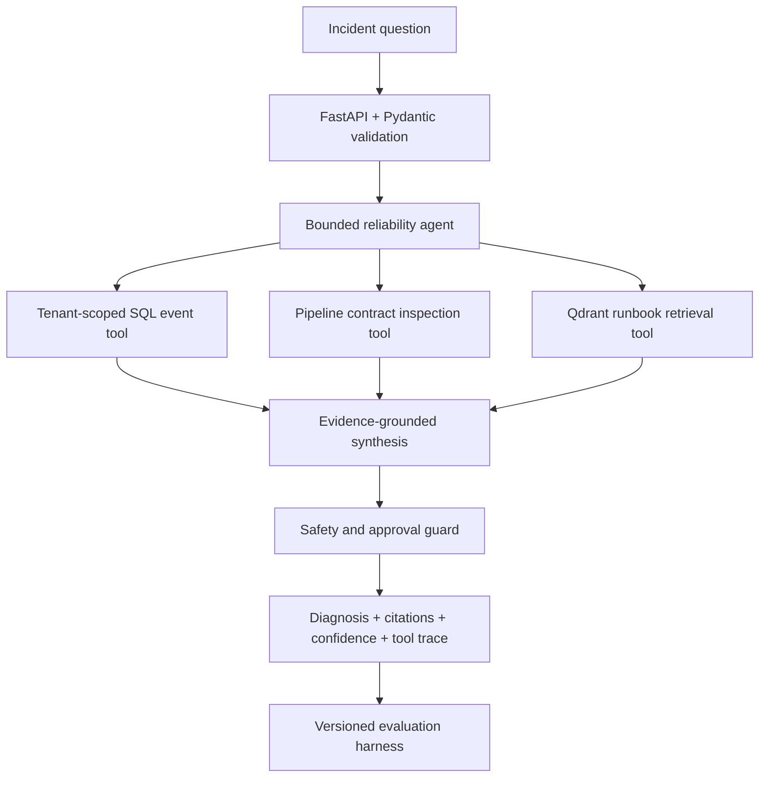

# Data Platform Reliability Agent

[](https://github.com/omni-shiva/shiva-applied-agentic/actions/workflows/ci.yml)
[](https://www.python.org/)
[](https://fastapi.tiangolo.com/)
[](LICENSE)

An evaluation-driven agent that investigates synthetic data-pipeline incidents, retrieves
relevant runbooks, inspects pipeline contracts, and proposes safe next actions without
executing remediation.

This is an independent portfolio implementation by **Shivanand Kumar**. It translates public
résumé themes into a reproducible system using entirely synthetic pipelines, tenants, events,
contracts and runbooks. It contains no employer source code, architecture, configuration or data.

## What it demonstrates

- A FastAPI service with typed request and response contracts.
- A bounded agent loop with three strict, read-only tools.
- Local Qdrant vector retrieval with deterministic zero-cost embeddings.
- Tenant-scoped SQL event queries and cross-tenant negative tests.
- Data-contract comparison for missing and unexpected fields.
- Evidence, citations, confidence, traceability and a human-approval boundary.
- A versioned 25-case evaluation suite covering tool selection, grounding and safety.
- Offline execution by default, with an optional OpenAI Responses API planner.
- Docker packaging and GitHub Actions validation.

## Résumé-grounded use cases

| Public résumé theme | Independent implementation in this repository |
|---|---|
| Data-product contract generation and validation | Versioned synthetic contracts, schema-diff evidence and regression tests |
| Pipeline reliability and operational diagnosis | Tenant-scoped event queries, incident signatures and runbook retrieval |
| Evaluation sets and approval gates | 25 versioned cases, deterministic metrics and no autonomous remediation |
| Pipeline observability and SLA monitoring | Run IDs, timestamps, volumes, latency, SLA comparisons and tool traces |
| Logging standardization | Correlation-field runbook and a dedicated logging-gap failure scenario |
| Spark and pipeline optimization | Performance-triage runbook covering volume, shuffle, skew and canary validation |

See [Résumé traceability](docs/resume-traceability.md) for the full boundary between the public
experience themes and this synthetic implementation.

## Architecture



The default planner is deterministic so anyone can run and evaluate the project without an API
key. When `AGENT_MODE=openai`, the planner can use the OpenAI Responses API to select the same
strict tools. The application still validates every tool argument, enforces tenant scope, limits
tool steps, and performs deterministic final safety checks.

More detail: [Architecture and trade-offs](docs/architecture.md).

## Quick start

```bash
python3.12 -m venv .venv
source .venv/bin/activate
python -m pip install -e ".[dev]"
uvicorn reliability_agent.api:app --reload
```

Open [http://127.0.0.1:8000/docs](http://127.0.0.1:8000/docs) for the generated API interface.

The offline demo starts with no credentials and no external services.

### Diagnose an incident

```bash
curl -s http://127.0.0.1:8000/v1/diagnose \
  -H 'Content-Type: application/json' \
  -d '{
    "tenant_id": "tenant_alpha",
    "pipeline_id": "orders_daily",
    "question": "Why did the latest orders pipeline fail after the source change?"
  }'
```

The response contains:

- a severity and issue summary;
- likely causes separated from direct evidence;
- tenant-scoped event and contract facts;
- retrieved runbook citations and similarity scores;
- recommendations and a proposed action;
- `approval_required=true` for state-changing recovery;
- `execution_performed=false` in every diagnosis;
- the complete read-only tool trace.

### Run the evaluation suite

```bash
reliability-agent-eval
pytest
ruff check .
```

The current suite contains 25 synthetic cases across schema mismatch, upstream delay, duplicate
keys, expired credentials, SLA breach, output loss and logging gaps. It evaluates tool selection,
expected incident signature, evidence grounding, citations and approval guarding separately.

See [Evaluation design](docs/evaluation.md).

## Optional OpenAI planner

The optional integration uses the OpenAI Responses API, strict function schemas, a bounded tool
loop and `store=false`. Keep the default offline mode for deterministic evaluation.

```bash
export AGENT_MODE=openai
export OPENAI_API_KEY='your-key'
export OPENAI_MODEL='gpt-5.6-sol'
uvicorn reliability_agent.api:app --reload
```

Relevant official guidance:

- [Responses API migration guide](https://developers.openai.com/api/docs/guides/migrate-to-responses)
- [Function calling and strict schemas](https://developers.openai.com/api/docs/guides/function-calling#strict-mode)
- [GPT-5.6 Sol prompting guidance](https://developers.openai.com/api/docs/guides/prompt-guidance-gpt-5p6.md)

No key is committed, logged or required by CI.

## Safety model

- The tool registry accepts only three read-only tools.
- Every tool call must match the authorized tenant context.
- Model-provided tenant arguments cannot broaden scope.
- The agent stops after a configurable maximum number of tool steps.
- Runbook text is treated as untrusted reference content.
- Diagnosis never executes remediation.
- The remediation endpoint produces a preview only and always requires human approval.
- Synthetic data makes the repository safe to inspect publicly.

In this demo, the request tenant is used as the authorized context. A production deployment would
derive it from verified identity middleware and apply the same scope to SQL and vector filters.

## Interview-ready explanation

Use this concise framing:

> I built an independent data-platform reliability agent that converts pipeline events, versioned
> contracts and operational runbooks into an evidence-grounded diagnosis. It uses tenant-scoped
> tools, Qdrant retrieval, strict schemas, a bounded tool loop and deterministic safety checks. It
> can recommend a recovery step, but it cannot execute one; human approval remains outside the
> service. I evaluate tool selection, grounding and approval behavior with versioned cases.

The [interview guide](docs/interview-guide.md) covers the architecture, failure cases and trade-offs
without implying that this public repository is employer production code.

## Repository layout

```text
src/reliability_agent/   API, tools, retrieval, agent and evaluation code
data/                    Synthetic events, contracts and runbooks
evals/cases.jsonl        Versioned evaluation dataset
tests/                   API, security, retrieval and evaluation tests
docs/                    Architecture, traceability and interview notes
.github/workflows/       Lint and test validation
```

## Roadmap

- Replace the demo request tenant with JWT-derived tenant context.
- Add hybrid retrieval and reranking behind the existing runbook interface.
- Add OpenTelemetry traces and latency/token/cost dashboards.
- Add an asynchronous incident-ingestion queue and dead-letter handling.
- Add a knowledge-graph adapter while preserving tool and evaluation contracts.
- Add staged, separately authorized remediation execution with canary and rollback controls.

## License

[MIT](LICENSE)
